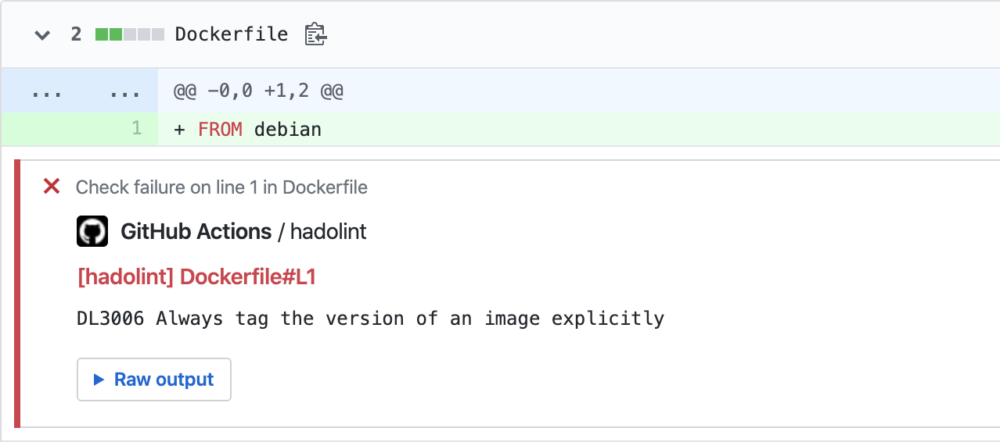
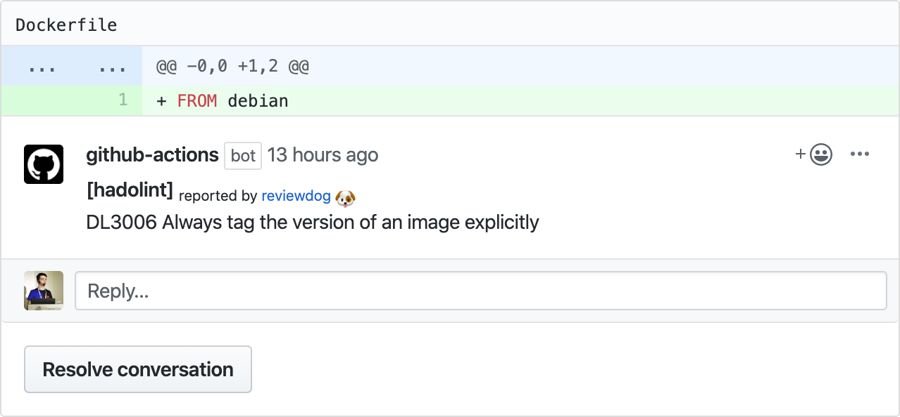

# GitHub Action: Run hadolint with reviewdog 🐶

[](./LICENSE)
[](https://github.com/reviewdog/action-hadolint/actions?query=workflow%3Adepup)
[](https://github.com/reviewdog/action-hadolint/actions?query=workflow%3Arelease)
[](https://github.com/reviewdog/action-hadolint/releases)
[](https://github.com/haya14busa/action-bumpr)

This action runs [hadolint](https://github.com/hadolint/hadolint) with
[reviewdog](https://github.com/reviewdog/reviewdog) on pull requests to lint Dockerfile 
and validate inline bash.

## Examples

### With `github-pr-check`

By default, with `reporter: github-pr-check` an annotation is added to the line:



### With `github-pr-review`

With `reporter: github-pr-review` a comment is added to the Pull Request Conversation:



## Inputs

### `github_token`

Optional. `${{ github.token }}` is used by default.

### `hadolint_flags`

Optional. Pass hadolint flags:
```
with:
  hadolint_flags: --trusted-registry docker.io
```

### `hadolint_ignore`

Optional. Pass hadolint rules to ignore them:
```
with:
  hadolint_ignore: DL3009 DL3008
```

### `tool_name`

Optional. Tool name to use for reviewdog reporter. Useful when running multiple
actions with different config.

### `exclude`

Optional. List of folders and files to exclude from checking.

Use `/%FOLDER%/*` to exclude whole folder or `%FILENAME%` to exclude certain files. 

Note that you can use wildcard to exclude certain file extensions, like `Dockerfile.*` will exclude `Dockerfile.dev`, but will not exclude `Dockerfile`.

You can combine those rules as you wish (i.e. exclude certain files from certain folders only):
```yaml
with:
  exclude: |
    /vendor/*
    Dockerfile.*
```

### `include`

Optional. Defaults to `*Dockerfile*`. List of folders and files to use for checking.

Use `/%FOLDER%/*` to include whole folder or `%FILENAME%` to include certain files.

Note that you can use wildcard to include certain file extensions, like `Dockerfile.*` will include `Dockerfile.dev`, but will not include `Dockerfile`.

You can combine those rules as you wish (i.e. exclude certain files from certain folders only):
```yaml
with:
  include: |
    subfolder/Dockerfile.*
```

### `level`

Optional. Report level for reviewdog [`info`, `warning`, `error`].
It's same as `-level` flag of reviewdog.

### `reporter`

Optional. Reporter of reviewdog command [`github-pr-check`, `github-pr-review`].
The default is `github-pr-check`.

### `filter_mode`

Optional. Filtering mode for the reviewdog command [`added`, `diff_context`, `file`, `nofilter`].
Default is `added`.

### `fail_on_error`

Optional.  Exit code for reviewdog when errors are found [`true`, `false`]
Default is `false`.

### `reviewdog_flags`

Optional. Additional reviewdog flags.

## Example usage

```yml
name: reviewdog
on: [pull_request]
jobs:
  hadolint:
    name: runner / hadolint
    runs-on: ubuntu-latest
    steps:
      - name: Check out code
        uses: actions/checkout@v4
      - name: hadolint
        uses: reviewdog/action-hadolint@v1
        with:
          reporter: github-pr-review # Default is github-pr-check
```

## Sponsor

<p>
  <a href="https://evrone.com/?utm_source=action-hadolint">
    
  </a>
</p>

## License

[MIT](https://choosealicense.com/licenses/mit)
